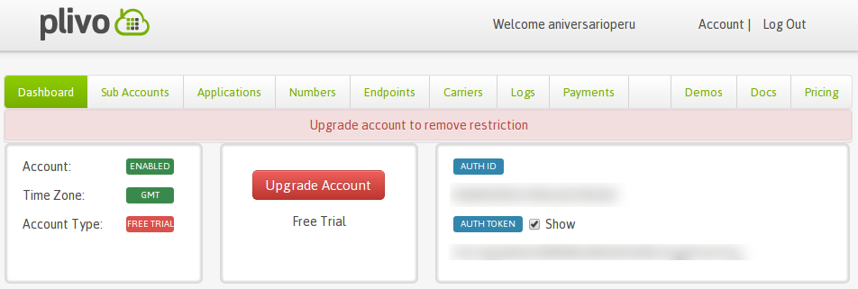

# Qué hace este bot?
Este bot vigila la página web que tú desees asegurándose que el servidor esté
funcionando correctamente. Si el servidor se ha caído,
[@ServulitoBot](https://twitter.com/ServulitoBot) enviará un mensaje de texto
al celular que tú escojas, además de emitir notificaciones vía *mentions* en
tuiter además de *direct message*.

## Cómo instalar y configurar @ServulitoBot
Tú puedes instalar este bot en tu computadora al hacer click en **Download ZIP**.
Además deberas abrir una cuenta en <http://plivo.com>. [@ServulitoBot](https://twitter.com/ServulitoBot)
ordenará a Plivo que envíe un mensaje de texto al determinado celular avisando
que el servidor se ha caído.

Es necesario que en el *Dashboard* de Plivo consigas tus llaves **AUTH ID** y
**AUTH TOKEN** (ver imagen).

También debes crear un *app* en tu cuenta de tuiter y obtener las **llaves** de
autenticación para que tu tuiterbot pueda enviar mensajes. En esta dirección
creas tu **app** y obtienes tus llaves: <https://dev.twitter.com/apps>.

Una vez que tengas tus llaves, debes cambiar de nombre al archivo
``config.py.bak`` por ``config.py``. Luego simplemente copias y pegas tus
llaves dentro del campo correspondiente en el archivo.

    # Twitter Consumer keys
    key = "aquiVaTuLlavePrincipal"
    secret = "aquiVaTuLLaveSecreta"
    token = "ponesAquiTuToken"
    token_secret = "AquiPonesTuTokenSecreto"

    # keys from http://plivo.com
    auth_id = ""
    auth_token = ""

## Dependencias
Para instalar y correr este bot necesitas tener los siguientes programas
instalados:

* Python 2.7+
* Además las siguientes librerías:
    
    * sudo pip install flask plivo
    * sudo pip install requests
    * sudo pip install requests_oauthlib

## Cómo correr @ServulitoBot?
Este bot corre desde la línea de comandos usando ciertos argumentos
importantes:

    python servulitobot.py -w http://miPaginaWeb.pe -m 'el server se ha caido' -d +51900755700 -t aniversarioperu

Los parámetros significan lo siguiente:

    -w es la página web a ser vigilada
    -m es el mensaje que se enviará como mensaje de texto al celular y como mensajes vía tuiter.
    -d es el número telefónico del celular destinatario
    -t es la cuenta de tuiter detinatario del mensaje via mention y dm.

